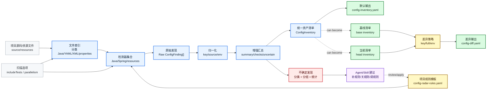
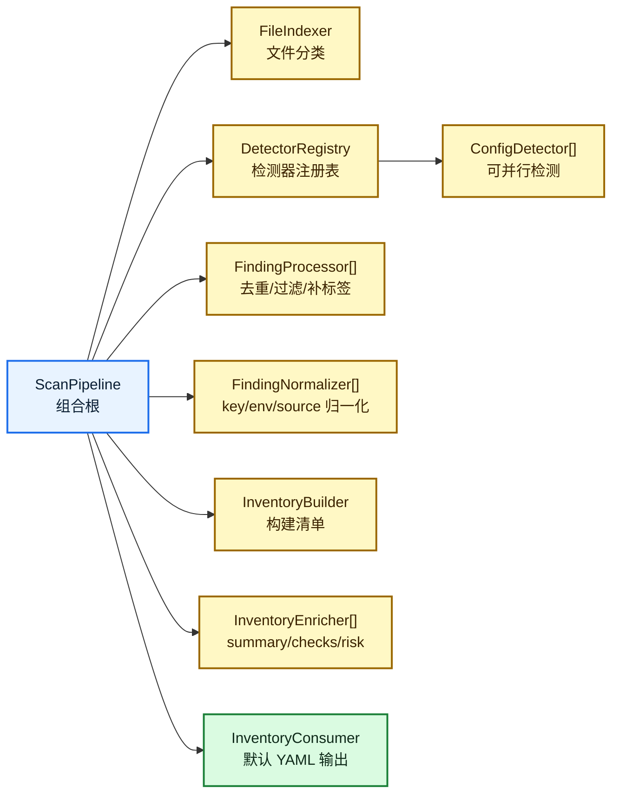

# Architecture

## Data Flow

Full scan:

```text
source/resources
  -> detectors
  -> raw findings
  -> normalize
  -> enrich
  -> ConfigInventory
  -> DefaultYamlConsumer
  -> config-inventory.yaml
```

Diff:

```text
inventory-base.yaml + inventory-head.yaml
  -> identity matching
  -> diff strategy
  -> config-diff.yaml
```

The scanner should not diff source text, YAML text, or final reports. It should diff normalized configuration facts.

## Parallel Execution

Default execution model:

```text
FileIndex
  -> JavaSourceSet[]
  -> ResourceFile[]

ResourceFile[]
  -> parallel resource detectors
  -> findings

JavaSourceSet[]
  -> OpenRewrite parse once per source set
  -> run Java detectors on shared parsed results
  -> findings

findings
  -> stable merge
  -> processors
  -> normalizers
  -> enrichers
  -> inventory
```

Defaults:

- `parallelism = min(availableProcessors, 8)`
- `javaParallelism = min(2, parallelism)`
- resource files scan by file
- Java scans run by module/source set
- OpenRewrite parse result is shared by Java detectors
- final output is sorted for deterministic YAML

Stable sort order:

1. source path
2. source line
3. detector id
4. role
5. key or expression

## Stable Models

- `ConfigFinding`: one atomic discovered fact
- `ConfigInventory`: full project inventory
- `UncertainFinding`: dynamic or low-confidence config access
- `ConfigDiff`: inventory comparison result
- `ConfigRule`: project-level declarative rule
- `ConfigConsumer`: output adapter

## Core Class Diagram

Class names stay in English so they can map directly to Java code. Chinese notes explain the responsibility of each core abstraction.

```mermaid
classDiagram
    class ScanInput:::core {
        +Path projectRoot
        +List~Path~ includePaths
        +List~Path~ excludePaths
        +Path rulesFile
        +EnvironmentHints environmentHints
        +BuildHints buildHints
    }

    class ScanOptions:::support {
        +boolean includeTests
        +boolean includeUncertain
        +int parallelism
    }

    class ScanContext:::core {
        +ScanInput input
        +ScanOptions options
        +ConfigRules rules
        +FileIndex fileIndex
    }

    class ConfigDetector:::core {
        <<interface>>
        +String id()
        +List~ConfigFinding~ detect(ScanContext context)
    }

    class ConfigFinding:::core {
        +String key
        +String normalizedKey
        +FindingRole role
        +SourceLocation source
        +Confidence confidence
        +String detectorId
        +FindingDetails details
    }

    class ScanFinding:::core {
        <<sealed interface>>
    }

    class UncertainFinding:::core {
        +String expression
        +String reason
        +String rootSink
        +SourceLocation source
        +Confidence confidence
    }

    class FindingProcessor:::core {
        +List~ConfigFinding~ process(List~ConfigFinding~ findings, ScanContext context)
    }

    class FindingNormalizer:::core {
        +List~ConfigFinding~ normalize(List~ConfigFinding~ findings, ScanContext context)
    }

    class InventoryEnricher:::core {
        +ConfigInventory enrich(ConfigInventory inventory, ScanContext context)
    }

    class SourceLocation:::core {
        +String path
        +Integer line
        +String symbol
        +SourceKind sourceKind
        +Scope scope
    }

    class FindingDetails:::core {
        <<sealed interface>>
    }

    class ConfigInventory:::core {
        +String schemaVersion
        +ProjectInfo project
        +List~ConfigFinding~ findings
        +List~UncertainFinding~ uncertain
        +InventorySummary summary
    }

    class InventoryBuilder:::core {
        +ConfigInventory build(List~ConfigFinding~ findings)
    }

    class ConfigRules:::extension {
        +List~MethodCallRule~ methodCalls
        +List~AnnotationRule~ annotations
        +List~ConfigFileRule~ configFiles
    }

    class InventoryConsumer:::output {
        <<interface>>
        +String id()
        +void write(ConfigInventory inventory, OutputStream out)
    }

    class ConfigDiffStrategy:::extension {
        <<interface>>
        +String id()
        +ConfigDiff diff(ConfigInventory base, ConfigInventory head)
    }

    class ConfigDiff:::output {
        +String schemaVersion
        +DiffSummary summary
        +List added
        +List removed
        +List changed
        +List uncertainChanged
    }

    note for ScanInput "扫描入口：项目路径、包含/排除路径、规则文件。只描述扫哪里。"
    note for ScanContext "扫描上下文：把输入、选项、规则、文件索引传给 Detector。"
    note for ConfigDetector "检测器接口：每个 detector 只负责发现一种配置事实。"
    note for ScanFinding "内部统一通道：确定发现和不确定发现都可以在 pipeline 中流转。"
    note for ConfigFinding "确定性发现：能说清 key、角色、来源、置信度。"
    note for UncertainFinding "不确定发现：动态 key 不猜测，保留表达式和原因。"
    note for FindingProcessor "原始发现处理：去重、过滤明显误报、补充基础标签。"
    note for FindingNormalizer "归一化：统一 key、role、source、profile/env。"
    note for InventoryEnricher "增强：生成 summary、checks、uncertain 分组和风险标记。"
    note for ConfigInventory "统一资产清单：所有输出和 diff 都基于它。"
    note for ConfigRules "项目规则模板：让用户用 YAML 扩展，而不是写代码。"
    note for InventoryConsumer "输出适配器：默认 YAML，未来接下游平台。"
    note for ConfigDiffStrategy "差异策略：比较两个 Inventory，不比较源码文本。"

    ScanContext --> ScanInput
    ScanContext --> ScanOptions
    ScanContext --> ConfigRules
    ConfigDetector --> ScanContext
    ScanFinding <|.. ConfigFinding
    ScanFinding <|.. UncertainFinding
    ConfigDetector --> ConfigFinding
    ConfigFinding --> SourceLocation
    ConfigFinding --> FindingDetails
    UncertainFinding --> SourceLocation
    FindingProcessor --> ConfigFinding
    FindingNormalizer --> ConfigFinding
    InventoryBuilder --> ConfigFinding
    InventoryBuilder --> ConfigInventory
    InventoryEnricher --> ConfigInventory
    ConfigInventory --> ConfigFinding
    ConfigInventory --> UncertainFinding
    InventoryConsumer --> ConfigInventory
    ConfigDiffStrategy --> ConfigInventory
    ConfigDiffStrategy --> ConfigDiff

    classDef core fill:#e8f3ff,stroke:#1f6feb,stroke-width:2px,color:#0b1f33
    classDef support fill:#f6f8fa,stroke:#8c959f,stroke-width:1px,color:#24292f
    classDef extension fill:#fff8c5,stroke:#9a6700,stroke-width:2px,color:#3b2300
    classDef output fill:#dafbe1,stroke:#1a7f37,stroke-width:2px,color:#0f2a1a
```



Legend:

- blue: core scan/inventory model, first version must be stable
- yellow: extension points, keep thin and configurable
- green: output/diff artifacts, downstream consumers depend on them
- gray: supporting options/context

中文说明：

| 类/接口 | 作用 | 你需要重点审核什么 |
|---|---|---|
| `ConfigFinding` | 一个确定的配置事实，比如 `payment.timeout` 在哪里定义/读取 | 字段够不够表达后续所有来源：key、角色、来源、置信度、detector |
| `UncertainFinding` | 动态 key、复杂拼接、未知 wrapper 等不确定事实 | 是否坚持“不猜 key，只暴露和统计”这个原则 |
| `ConfigInventory` | 统一资产清单，所有输出和 diff 的基础 | schema 是否能承载全量、增量、环境、风险、下游消费 |
| `ConfigDetector` | 扩展扫描能力的最小接口 | detector 是否足够独立，能否并行跑，是否不依赖输出格式 |
| `ConfigRules` | 项目级 YAML 规则模板 | 是否能减少写 Java 插件的需求 |
| `ConfigDiffStrategy` | 差异计算策略 | 是否确认 diff 只基于 inventory，而不是源码文本 |
| `InventoryConsumer` | 输出适配器 | 默认 YAML 够用即可，先不要过早做很多 consumer |

## Data Flow Diagram



数据流说明：

1. `FileIndex` 先把文件分类，避免所有 detector 都扫全仓库。
2. `ConfigDetector[]` 只负责产出原始发现，不负责输出、不负责 diff。
3. `Normalize` 统一 key、来源、profile/env，避免下游各自理解。
4. `Enrich` 生成 summary/checks/uncertain，把动态配置显式暴露出来。
5. `ConfigInventory` 是核心资产，默认 YAML、diff、未来下游平台都消费它。
6. `Agent/Skill` 只产出建议，用户确认后才写入 `config-radar-rules.yaml`。

你需要重点审核：

- `ConfigFinding` 是否是足够稳定的最小事实模型。
- `UncertainFinding` 是否能支撑动态配置增长统计和高风险标注。
- `ConfigRules` 是否应该第一版就包含 method/annotation/file 三类规则。
- `Normalize` 是否要做 Spring relaxed binding，还是先保守处理。
- `Diff` 是否确认只比较 inventory，避免被源码格式变化干扰。
- `InventoryConsumer` 是否第一版只保留默认 YAML，其他下游延后。

## Finding Model Decision

Use a hybrid model:

```text
internal pipeline: unified ScanFinding
external inventory: separated items and uncertain sections
```

Shape:

```java
sealed interface ScanFinding permits ConfigFinding, UncertainFinding {}

record ConfigFinding(
    String key,
    String normalizedKey,
    FindingRole role,
    SourceLocation source,
    Confidence confidence,
    String detectorId,
    FindingDetails details
) implements ScanFinding {}

record UncertainFinding(
    String expression,
    UncertainReason reason,
    String rootSink,
    SourceLocation source,
    Confidence confidence,
    String detectorId,
    UncertainDetails details
) implements ScanFinding {}

record ConfigInventory(
    List<ConfigFinding> items,
    List<UncertainFinding> uncertain,
    InventorySummary summary
) {
    List<ScanFinding> allFindings() {
        // derived view, not separately serialized
    }
}
```

Why:

- `ConfigFinding.key` stays required.
- dynamic keys do not pollute confirmed config facts.
- detector and processor pipelines can still treat both as scan findings.
- YAML stays easy to read:
  - `items` for confirmed config facts
  - `uncertain` for dynamic or unresolved facts
- diff can handle key changes and uncertain-pattern changes separately.

Rejected alternatives:

- single mixed `findings` list: easier internally, but every consumer must branch on type and `key` becomes easy to misuse.
- completely separate models with no common parent: clearer externally, but internal processing and source-order reporting become awkward.

## Composition-First Design

Prefer composition over inheritance for implementation.

The scanner should be assembled from small components:

```text
ScanPipeline =
  FileIndexer
  + DetectorRegistry
  + FindingProcessor[]
  + FindingNormalizer[]
  + InventoryBuilder
  + InventoryEnricher[]
  + InventoryConsumer
```



Component rules:

- no abstract base class unless it removes real duplication
- each component has one small interface and one responsibility
- components communicate through typed models, not raw maps
- detector components can run in parallel
- processor, normalizer, and enricher components run in configured order
- packs should contribute components or rules, not change the pipeline shape

Example assembly:

```java
record ScanPipeline(
    FileIndexer fileIndexer,
    DetectorRegistry detectorRegistry,
    List<FindingProcessor> processors,
    List<FindingNormalizer> normalizers,
    InventoryBuilder inventoryBuilder,
    List<InventoryEnricher> enrichers
) {}
```

Pack contribution should also be compositional:

```java
interface DetectorPack {
    String id();
    List<ConfigDetector> detectors();
    List<ConfigRule> rules();
}
```

Phase 1 can hard-code the default component list. Later, CLI config or rule packs can assemble the same pipeline with additional components.
`ScanPipelineBuilder.detectorPack(...)` already accepts pack-contributed detectors; pack rule merging should stay as a separate explicit rule-loading step so scan data flow remains auditable.

## Extension Points

Keep extension points thin:

```java
interface ConfigDetector {
    List<ConfigItem> detect(ScanContext context);
}

interface ConfigConsumer {
    String name();
    void write(ConfigInventory inventory, OutputStream out);
}

interface ConfigDiffStrategy {
    String name();
    ConfigDiff diff(ConfigInventory base, ConfigInventory head, DiffOptions options);
}
```

## Hook Points

Keep hooks at stage boundaries. Do not let one hook own the whole pipeline.


Hook levels:

| 级别 | 含义 | 原则 |
|---|---|---|
| L0 | 第一版框架必须实现并定义接口 | 不实现会导致后续改主流程 |
| L1 | 第一版作为内部阶段实现，可先有接口但只放内置实现 | 流程里先嵌入，外部插件加载后置 |
| L2 | 先保留设计 | 等真实场景出现再实现 |

Recommended hooks:

| Hook | 级别 | 位置 | 用途 | 第一版建议 |
|---|---|---|---|---|
| `DetectorHook` | L0 | detector 执行阶段 | 新增 Java/Spring/配置中心/三方组件扫描器 | 必须实现为 `ConfigDetector` |
| `NormalizeHook` | L0 | 归一化阶段 | key、source、env/profile、role 归一化 | 必须实现为稳定阶段，可先只有内置 normalizer |
| `EnrichHook` | L0 | inventory 前 | summary、checks、uncertain 分组、风险标签 | 必须实现为稳定阶段，可先只有内置 enricher |
| `DiffHook` | L0 | diff 阶段 | 自定义 added/removed/changed 判断、环境差异策略 | 必须实现为 `ConfigDiffStrategy` |
| `ConsumerHook` | L0 | 输出阶段 | 输出默认 YAML，未来接下游格式 | 必须实现为 `InventoryConsumer`，第一版只提供 YAML |
| `FileIndexHook` | L1 | 文件分类后 | 识别自定义配置文件、特殊目录、生成文件 | 定义 `FileIndexer` 接口，第一版只放内置实现 |
| `FindingHook` | L1 | raw finding 后 | 过滤误报、补标签、合并重复发现 | 定义 `FindingProcessor` 接口，第一版只放内置实现 |
| `InputHook` | L2 | 扫描开始前 | 改写 include/exclude、加载额外规则、补环境参数 | CLI options 先够用 |
| `SuggestionHook` | L2 | 扫描或 diff 后 | Agent/Skill 生成补规则、关规则、调规则建议 | 文档保留，后续实现 |

Hook principles:

- hooks consume and produce typed models, not raw strings
- hooks should be deterministic unless explicitly marked as agent-assisted
- agent hooks only produce suggestions; user-reviewed rules change scan behavior
- detector hooks can run in parallel, but normalize/enrich hooks should be ordered
- hook outputs must include `detectorId` or `hookId` for auditability
- new fields should be added as typed value objects or typed detail records, not as catch-all extension maps

First implementation should expose:

- `ConfigDetector`
- `FileIndexer`
- `FindingProcessor`
- `FindingNormalizer`
- `InventoryEnricher`
- `ConfigDiffStrategy`
- `InventoryConsumer`

They can start with one built-in implementation each. External plugin loading can come later, but the pipeline should call these interfaces from the beginning.

## Extensible Parameters

Use small typed objects for extension data. Avoid generic `Map<String, Object>` as a primary extension mechanism because it hides meaning, weakens validation, and tends to rot.

The goal is self-describing models: when a field is added, the code and documentation should make its meaning clear.

### Parameter Principles

- prefer context objects over long method parameter lists
- keep input/output immutable where possible
- keep common fields typed, not hidden in maps
- group related optional fields into typed value objects
- use sealed interfaces for variant-specific details when the shape is known
- add Javadoc/comments to explain field meaning and source
- avoid leaking parser-specific objects into public models
- include `schemaVersion` on serialized outputs
- include `detectorId`, `ruleId`, or `hookId` for auditability
- use raw metadata maps only as a last-resort quarantine, not as normal modeling

### Suggested Shapes

```java
record ScanInput(
    Path projectRoot,
    List<Path> includePaths,
    List<Path> excludePaths,
    Optional<Path> rulesFile,
    EnvironmentHints environmentHints,
    BuildHints buildHints
) {}

record ScanOptions(
    boolean includeTests,
    boolean includeUncertain,
    int parallelism,
    ScanMode scanMode
) {}

record ConfigFinding(
    String key,
    String normalizedKey,
    FindingRole role,
    SourceLocation source,
    Confidence confidence,
    String detectorId,
    FindingDetails details
) {}

record SourceLocation(
    String path,
    OptionalInt line,
    Optional<String> symbol,
    SourceKind sourceKind,
    Scope scope
) {}
```

Typed detail examples:

```java
sealed interface FindingDetails permits
    SpringPlaceholderDetails,
    SpringConfigurationPropertiesDetails,
    JavaSystemPropertyDetails,
    ConfigCenterDetails,
    ExternalDetails,
    UnknownDetails {}

record SpringPlaceholderDetails(
    Optional<String> defaultValue,
    String rawExpression
) implements FindingDetails {}

record SpringConfigurationPropertiesDetails(
    String prefix,
    Optional<String> boundType,
    boolean inferredFromFields
) implements FindingDetails {}

record JavaSystemPropertyDetails(
    Optional<String> defaultValue,
    boolean fromConstant
) implements FindingDetails {}

record ConfigCenterDetails(
    Optional<String> namespace,
    Optional<String> group,
    Optional<String> dataId,
    Optional<String> defaultValue
) implements FindingDetails {}

record ExternalDetails(
    String namespace,
    String type,
    JsonNode payload
) implements FindingDetails {}

record UnknownDetails(
    String reason,
    String rawText
) implements FindingDetails {}
```

Input hint examples:

```java
record EnvironmentHints(
    Optional<String> activeProfile,
    Optional<String> region,
    Optional<String> namespace
) {}

record BuildHints(
    BuildTool buildTool,
    List<Path> sourceRoots,
    List<Path> resourceRoots
) {}
```

Fields that most consumers need should stay on the main model:

- key
- normalized key
- role
- source
- confidence
- detector id
- value/default value
- environment/profile when promoted later

### Detail Modeling Strategy

Use typed detail objects for stable built-in detectors. Use `ExternalDetails` only for third-party packs or experimental detectors. Use `UnknownDetails` for truly unknown patterns.

Policy:

- core built-in detectors must emit typed details
- third-party packs may emit `ExternalDetails`
- `ExternalDetails.namespace` must identify the pack or ecosystem, for example `redisson` or `apollo`
- `ExternalDetails.type` must identify the payload shape
- `UnknownDetails` should preserve reason and raw text for later analysis
- repeated stable `ExternalDetails` or `UnknownDetails` should be promoted into a typed detail object

Avoid using `ExternalDetails` as a shortcut inside core detectors.

### Compatibility Rule

Adding optional fields is allowed. Renaming or changing meaning of existing fields requires a schema version bump.

## JDK Compatibility

Do not confuse ConfigRadar's runtime JDK with the scanned project's Java source level.

Recommended baseline:

- ConfigRadar runtime: JDK 21+
- scanned project source level: Java 8 through modern Java, where parser support is available

Why:

- ConfigRadar can use Java records, sealed interfaces, and cleaner internal models.
- A tool running on JDK 21 can still parse and analyze Java 8, 11, 17, 21, or newer projects where parser support is available.
- Target source level should be detected from project build files or passed explicitly.

Source level detection order:

1. Maven compiler plugin `release`, `source`, or `target`
2. Gradle `sourceCompatibility` or `targetCompatibility`
3. Java toolchains
4. explicit CLI option such as `--source-level 8`
5. fallback default

Model rule:

- `ConfigFinding` is for confirmed keys, so `key` and `normalizedKey` are required.
- `UncertainFinding` is for dynamic or unresolved keys, so it keeps expression/reason instead of an optional key.

## Module Skeleton

This is a direction, not a commitment to create all modules on day one.

```text
config-radar-core
  inventory schema, finding model, uncertain model, diff model, rule model

config-radar-scan
  detector API, built-in Java/Spring detectors, rule-driven detectors

config-radar-profile
  later deep trace profiler and rule suggestion generation

config-radar-consumer
  default YAML consumer first, future consumers later

config-radar-packs
  later ecosystem detector/rule packs

config-radar-agent-skill
  report explanation, tuning guidance, rule suggestions
```

## Scan Modes

### Static Source Scan

Best for:

- full inventory
- source-level diff
- release review
- custom rule onboarding

Limitations:

- cannot fully resolve dynamic keys
- cannot know real runtime values
- cannot know remote config-center final values

### Artifact or JAR Scan

Best for:

- release artifact validation
- scanning packages without source
- verifying what was actually packaged
- reading generated Spring metadata

### Runtime Snapshot Scan

Best for:

- production or staging config snapshot
- final environment verification
- incident investigation
- effective-config comparison

Phase 1 should focus on static source scan.
