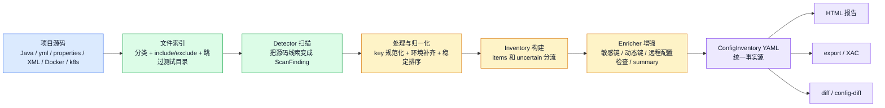
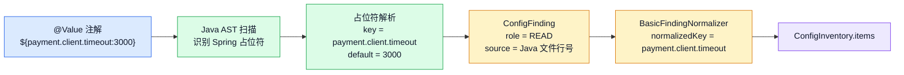
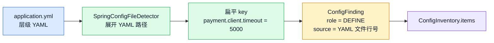
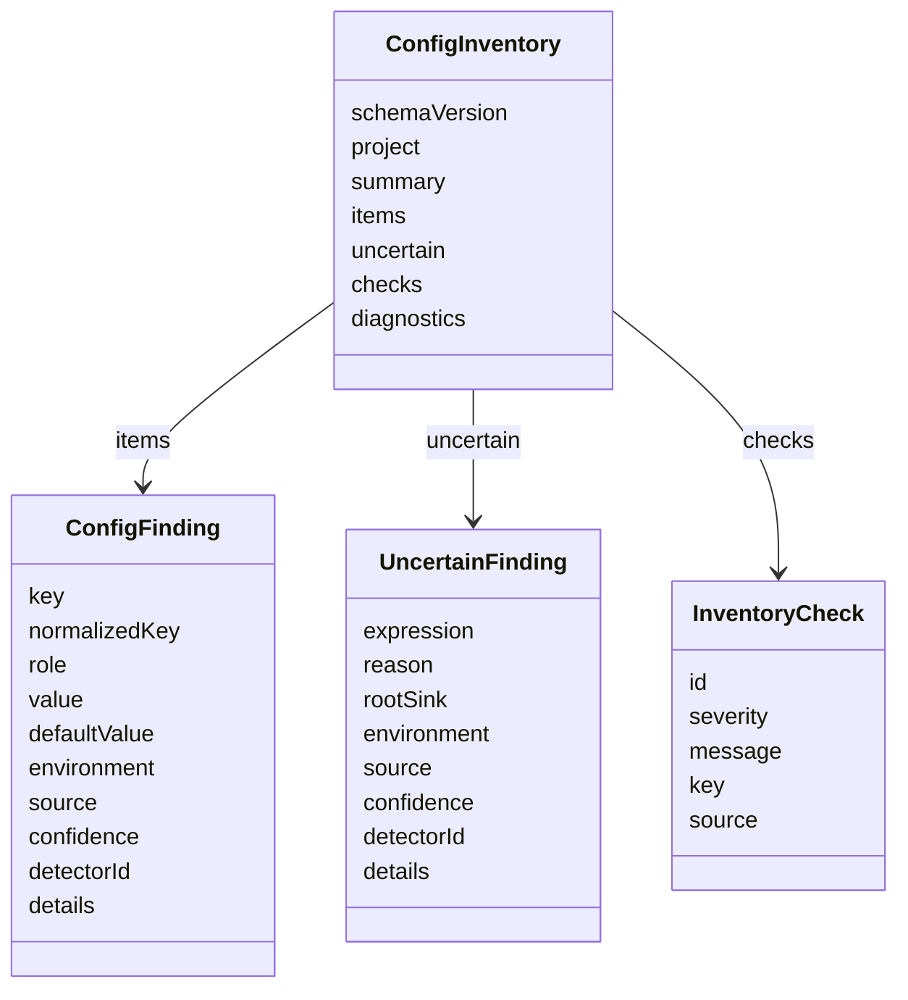
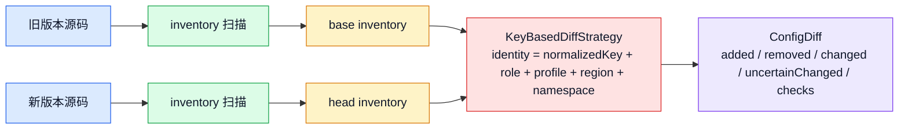
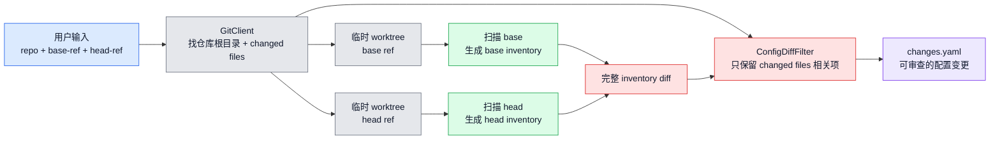
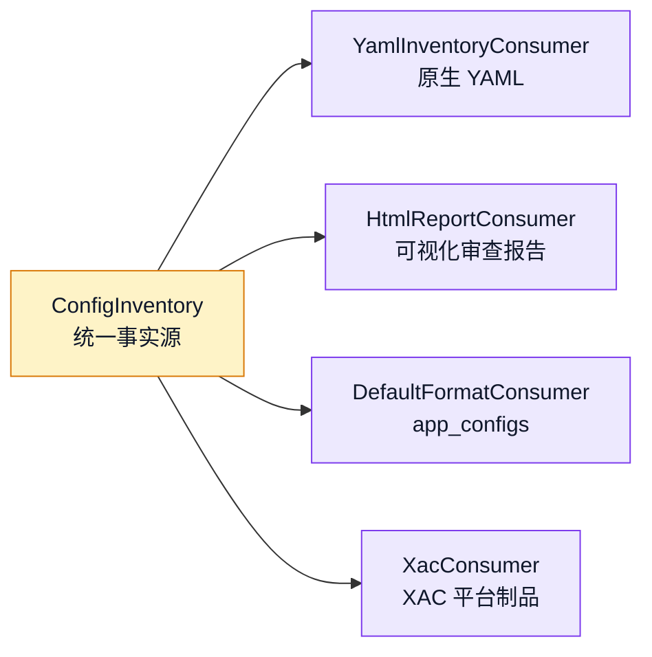

# ConfigRadar 当前代码现状与数据流

这份文档用于演示 ConfigRadar 的整体思路：它不是直接把源码文本转成下游格式，而是先把各种配置线索统一成一份稳定的配置事实清单，再让 diff、export、HTML 报告等下游消费这份清单。

## 一句话现状

ConfigRadar 当前已经形成了四层架构：

| 层次 | 人话职责 | 代码入口 |
|---|---|---|
| 输入层 | 接收项目路径、profile、规则、include/exclude 等扫描参数 | `ConfigRadarCli` / `ScanInput` / `ScanOptions` |
| 扫描层 | 静态扫描 Java、Spring 配置文件、部署文件、XML、HOCON、metadata、可选 codegraph 语义索引 | `ScanPipeline` + 多个 `ConfigDetector` |
| 事实模型层 | 把扫描结果变成稳定模型：确定事实进入 `items`，动态或不确定线索进入 `uncertain` | `ConfigFinding` / `UncertainFinding` / `ConfigInventory` |
| 消费层 | 同一份 inventory 可输出 YAML、HTML、app_configs、XAC，或进入 diff | `InventoryConsumer` / `KeyBasedDiffStrategy` / `ConfigDiffCommand` |

## 核心数据流



关键点：**ConfigRadar 不 diff 源码，也不 diff HTML/下游格式；它 diff 归一化后的配置事实。**

## 数据转换过程

### 例子 1：`@Value` 注解读取

输入代码：

```java
@Value("${payment.client.timeout:3000}")
private int timeout;
```

转换过程：



对应的事实结构大概是：

```yaml
items:
  - key: payment.client.timeout
    normalizedKey: payment.client.timeout
    role: READ
    value: null
    defaultValue:
      raw: "3000"
      type: NUMBER
    source:
      path: src/main/java/.../PaymentClient.java
      line: 12
      sourceKind: JAVA
    confidence: HIGH
    detectorId: java-source-config
```

### 例子 2：`application.yml` 定义

输入配置：

```yaml
payment:
  client:
    timeout: 5000
```

转换过程：



这类事实的 `role` 是 `DEFINE`，表示“项目声明了这个配置值”。它和 Java 里的 `READ` 会在同一份 inventory 里并存，所以一个 key 既能看到“哪里定义”，也能看到“哪里读取”。

### 例子 3：动态 key 不猜

输入代码：

```java
environment.getProperty(prefix + ".timeout");
```

如果 `prefix` 无法静态解析，ConfigRadar 不会猜一个 key，而是进入 `uncertain`：

```yaml
uncertain:
  - expression: prefix + ".timeout"
    reason: DYNAMIC_EXPRESSION
    rootSink: Environment.getProperty
    source:
      path: src/main/java/.../PaymentClient.java
      line: 20
    confidence: LOW
```

这个设计的目标是：**确定的配置事实进入 `items`，不确定表达式进入 `uncertain`，避免误报污染主清单。**

## Inventory 的结构



演示时可以把它翻译成三句话：

- `ConfigFinding`：已经确认 key 的配置事实，比如“定义了 `server.port=8080`”或“代码读取了 `payment.client.timeout`”。
- `UncertainFinding`：有配置访问意图，但 key 是运行时拼出来的，静态阶段不能确定。
- `InventoryCheck`：基于事实自动推出来的审查提示，比如敏感键、动态 key、远程配置中心入口。

## Diff 场景数据流

普通 diff 是两步：先分别扫描两个状态，再比较两份 inventory。



diff 的身份键目前是：

```text
normalizedKey + role + profile + region + namespace
```

也就是说，`payment.client.timeout` 在 `prod` profile 下的 `DEFINE` 和同一个 key 的 `READ` 是两条不同事实；这样可以分别判断“定义变了”还是“读取变了”。

## `config-diff` 的完整链路

`config-diff` 是给 git 提交流程用的端到端命令。它比普通 diff 多做一步：只保留 git 变更文件相关的配置变化，降低审查噪音。



注意边界：

- `diff` 命令：用户已经有两份 inventory，直接比。
- `config-diff` 命令：用户给两个 git ref，工具自己 checkout 临时 worktree、扫描、diff、过滤。
- 两者最终都落到同一个 `ConfigDiff` 模型。

## HTML 报告在架构里的位置

HTML 报告不是扫描引擎的一部分，它只是一个 `InventoryConsumer`：



所以报告页的正确定位是：**把 inventory 投影成人能审查的页面**，比如统计卡、分布图、每个 key 的生效值、所有来源弹窗、不确定项和诊断信息。

## 当前扩展点

| 扩展点 | 适合扩展什么 |
|---|---|
| `ConfigDetector` | 新配置来源、新注解、新配置 API、新文件格式 |
| `FindingNormalizer` | key 规范化、环境补齐、稳定排序、别名归一 |
| `InventoryEnricher` | 敏感键、风险评分、owner、远程配置检查、graph sidecar |
| `ConfigDiffStrategy` | 更复杂的 identity、移动检测、影响面 diff |
| `InventoryConsumer` | HTML、CSV、平台 YAML、XAC、CI 审查报告 |
| `config-radar-rules.yaml` | 项目自定义注解、方法调用、配置文件规则 |

## 演示主线

建议按这条线讲：

1. 先展示 `@Value("${payment.client.timeout:3000}")` 和 `application.yml`，说明它们都会变成 `ConfigFinding`。
2. 再展示动态 key，说明不确定的不会猜，而是进入 `uncertain`。
3. 展示 inventory：它是所有下游的统一事实源。
4. 展示 HTML 报告：这是 inventory 的人类审查视图。
5. 展示 diff/config-diff：不是比源码文本，而是比两份配置事实，并且 `config-diff` 会用 git changed files 做降噪。
